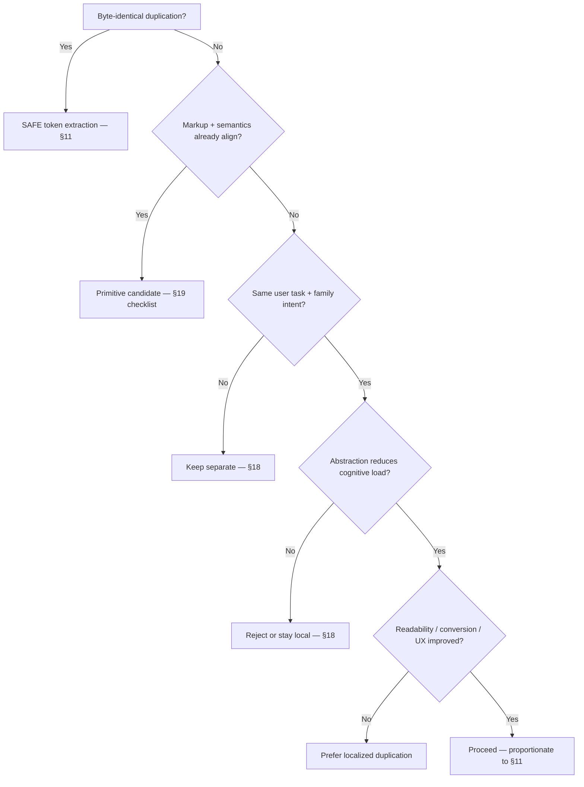
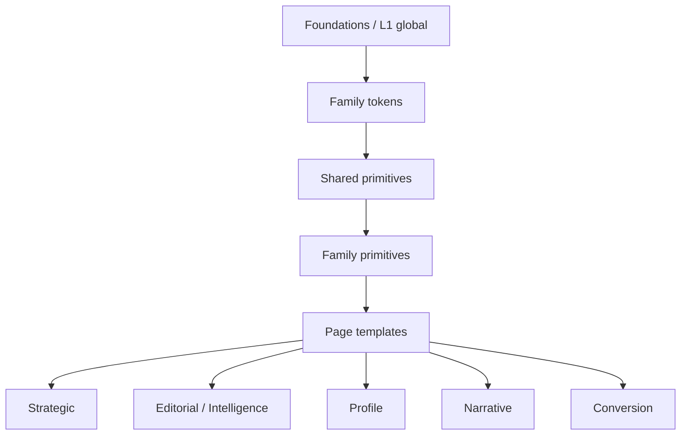

# Schillings Astro — design system & implementation governance

**Status:** Production engineering governance framework  
**Scope:** `site/src/` (Astro app), aligned with current routes, components, and `lib/visual-tokens.ts`  
**Audience:** Engineers, reviewers, product/design/legal stakeholders for gated changes  

**Immutable without explicit review:** SEO, `hreflang`, metadata, JSON-LD, routing, compliance/legal copy, analytics hooks, API behaviour, form behaviour, conversion flows, sitemap/canonical logic.

**Supersession rule:** **Family intent contracts** (§3) override “make it consistent” unless product/design **explicitly** approves a **family-level** shift.

**Governance version:** 1.0 — milestone label only (not semver).  
**Last major governance revision:** 2026-05-06  

**Major revisions** to this file should briefly record **what** changed, **why**, and whether **contributor expectations** shifted — in the PR description (and in **[ADRs](./architecture/adr/)** or a project `CHANGELOG` when the team maintains one).

**Entry points:** [`CONTRIBUTING.md`](../../CONTRIBUTING.md) (repo root), [PR template](../../.github/pull_request_template.md), [RFC template](./architecture/rfc-template.md).

**Scope:** This governance applies to **platform architecture** and **shared implementation patterns** in `site/src/`. It is **not** meant to govern individual content decisions, one-off campaign pages, or isolated experiments **unless** they introduce **reusable platform behaviour** (new primitives, cross-family patterns, token promotions, routing/schema).

---

## 1. Primary objective

| Goal | Enforcement |
|------|-------------|
| **Shared** | SAFE-classified token deduplication; small primitives; **§22 Safe abstraction checklist** passes |
| **Family-specific** | Layout, heroes, widths, CTAs, cards, breadcrumb **component** choice |
| **Never abstracted** | `QualifyingForm`, article prose measure, Contact funnel width, sticky profile system, structured data **shapes**, migration rules |
| **Governance** | **§11 Change classification** → **§12 Escalation** → **§30 PR expectations** → **§20 QA** → **§32 Enforcement** |

The site should feel **coherent, not identical**.

### Shared understanding over perfect consistency

**Shared understanding** is more valuable than **perfect consistency**. A **slightly duplicated but understandable** system is healthier than a **perfectly unified but opaque** one — align with **§18**, **§44**, **§58**, and **§41**.

### Architecture readability

**Architecture should be understandable from normal implementation work.** Contributors should **not** need deep governance literacy to ship **routine**, **SAFE**, or **family-local** changes safely — save full-document study for **cross-family**, **shared primitive**, and **HIGH RISK** work (**§2** reading paths).

### How design-system success is measured

Success is measured by **product and engineering outcomes**, not by **how much code is shared**:

- **Product clarity** — users understand task and trust surfaces.  
- **Contributor confidence** — proportionate process, not fear (**§54**, **§65**).  
- **Platform trust** — **intentional** patterns, **stable** protected surfaces (**Appendix A**), **discoverable** decisions (**§42**, ADRs); **opaque** architecture or **heavy** process that causes **hesitation** is a **quality defect** to fix (**§35**, **§60**).  
- **Implementation quality** — correct, accessible, maintainable templates.  
- **Readability** — templates and components stay legible over time.  
- **Conversion effectiveness** — funnel and protected flows stay sound (**Appendix A**).  
- **Operational maintainability** — ownership, drift control, and safe evolution (**§32–34**).

**Shared code volume is not a KPI.**

### Contributor confidence (platform KPI)

**Routine improvements** should be possible **confidently** and **safely** under **§3** and **§11**. **Systemic hesitation** — people avoiding sensible fixes because the model feels **risky** or **illegible** — is a **platform quality** issue: clarify paths (**§2**), calibrate review (**§60**), or simplify rules (**§62–65**), not “more caution.”

---

## 2. Document map

| Section | Purpose |
|---------|---------|
| §2 | Document map; **recommended reading paths**; **quick abstraction flow** |
| §3–5 | Intent, consistency thresholds, families |
| §6–10 | Hierarchy, ownership, tokens, primitives, protected merges |
| §11–14 | Classification, escalation, success metrics, stability guarantees |
| §15–18 | Rules, anti-patterns, leakage, stop conditions, safe abstraction |
| §19–21 | Rollout, QA, engineer checklist, decision table |
| §22–31 | RFC, exceptions, drift, deprecation, ergonomics, expansion, perf/a11y, debt, PR template |
| §32–40 | **Enforcement & sustainability:** enforcement model, ownership continuity, observability, review fatigue, doc evolution, cross-family rules, abstraction exit, maturity model, onboarding |
| §41 | **Final governance statement** (operating doctrine) |
| §42–51 | **Long-term architecture:** decision traceability, implementation reality, maintainability, repo health, abstraction lifecycle, failure modes, explicit difference, design-system boundaries, review heuristics, closing principle |
| §52–61 | **Operational evolution:** architectural change log, governance discoverability, contributor autonomy, scale resilience, semantic honesty, longevity, contextual simplicity, platform identity, review calibration, final operational closing |
| §62–67 | **Governance operations:** self-maintenance, doc structure & size, terminology stability, pragmatism, platform memory, sustainability closing |
| **ADR index & appendices** (below §67) | Searchable decisions; protected systems; abstraction cheat sheet; canonical terminology; abstraction examples; **governance health signals** |

### Recommended reading paths

| Role | Start here |
|------|------------|
| **New contributors** | §1–7, §14–18, §22, §30, §41 |
| **Design-system / token contributors** | §5–11, §14–19, §32–40 |
| **Editorial / Intelligence work** | §2, §3–4, §8, §15, §16 |
| **Conversion / Contact work** | §2, §3–4, §9, §11, Appendix A |
| **Architecture maintainers** | Full document + ADR index |

### Quick decision flow (abstraction)

Operational shorthand — complements **§11**, **§18–19**, **Appendix B**.

---

## 3. Family intent contracts

**If a change weakens primary intent, reject it** — even if it improves superficial consistency. **This supersedes token-purity goals.**

| Family | Primary intent | Secondary intent | **Must NEVER become** |
|--------|----------------|------------------|-------------------------|
| **Strategic hub** | Orientation + chapter navigation | Brand positioning | Editorial archive |
| **Strategic detail** | Guided strategic reading | Conversion (confidential enquiry) | News article |
| **Editorial index** | Discovery + scanning | Authority signalling | Marketing hub |
| **Editorial article** | Long-form reading | E-E-A-T | Landing page |
| **Directory** | Utility filtering | Discovery | Narrative page |
| **Profile** | Trust + expertise validation | Relationship initiation | Strategic chapter |
| **Narrative marketing** | Brand storytelling | Credibility | Utility flow |
| **Conversion / utility** | Enquiry completion | Crisis routing | Editorial experience |

**Reject without family-level approval (examples):** widening editorial prose “for consistency”; Contact as strategic hero; editorial cards → `HubLinkCard`; profile CTAs → `CtaConfidentialBand`.

---

## 4. Visual consistency thresholds

**Aim:** Shared **brand language**, not identical systems.

**Should feel consistent:** spacing quality, typography quality, interactions, palette, focus, borders, hover/motion restraint, accessibility.

**Should differ by family:** hero hierarchy, density, prose width, card hierarchy, CTA tone, heading scale, breadcrumb visibility, pacing, scanning vs reading.

**Bar:** Users sense **one firm**; they must not sense **one template everywhere**.

---

## 5. Canonical template families (repo-grounded)

Families are **implied by implementation**, not invented.

- **Strategic hub / detail:** Situations, WWP, Response, Expertise — `StrategicPageTitle`, `StrategicBreadcrumb`, `SectionKicker`, `HubLinkCard`, `CtaConfidentialBand`, `DocumentMain` wide patterns.
- **Editorial index / article:** `/news/*`, `NewsArchiveIndexHero`, `NewsHubIndexHero`, `NewsArticlePostHero`, `NewsArticleEditorialCard`, `NEWS_*` tokens, featured vs grid, article body `max-w-3xl`.
- **Directory / profile:** `/people`, `PeopleDirectory`, `PEOPLE_*_H1_CLASS`, split hero + sticky image, profile `SectionKicker` usage, People breadcrumbs (current).
- **Narrative marketing:** `AboutUsRegional.astro`, banded sections, mission inversion, `PageBreadcrumbs`, `PersonColleagueCard` leadership grid.
- **Conversion / utility:** `contact/*`, `ContactPageBody`, `QualifyingForm`, `PageBreadcrumbs`, inner `max-w-2xl`, utility section headings.

---

## 6. System hierarchy model

| Level | Contents | Ceiling |
|-------|----------|---------|
| **L1 Global** | Theme, `Base`, `DocumentMain`, `SiteHeader`, i18n helpers | No business rules |
| **L2 Family tokens** | `STRATEGIC_PAGE_H1_CLASS`, `PEOPLE_*`, `NEWS_*`, hub/CTA tokens | No silent “promotion” to global |
| **L3 Shared primitives** | `SectionKicker`, `StrategicPageTitle`, `StrategicBreadcrumb`, `PageBreadcrumbs`, `HubLinkCard`, `CtaConfidentialBand` | No family enums |
| **L4 Family primitives** | News mastheads, editorial cards, directory, colleague cards | Compose L3 only |
| **L5 Specialized** | Page templates, JSON-LD builders, `QualifyingForm`, middleware | Never “universal page” |

**Must not move upward:** `QualifyingForm` behaviour, article `max-w-3xl`, Contact inner width, sticky profile, featured editorial hierarchy, schema shapes, migration rules.

### Visual stack (onboarding)

One-page mental model: **shared layers** stack vertically; **page templates** sit at the bottom and branch into **family lanes** (same stack, different composition — **coherent, not identical**).

---

## 7. Ownership model

**Core architecture owner:** `DocumentMain`, `visual-tokens.ts`, `Base.astro`, global a11y/spacing, token governance. **Cannot** unilaterally redefine family behaviour, conversion UX, or editorial hierarchy.

**Family owners (accountability):**

| Owner | Owns | Must not redefine |
|-------|------|-------------------|
| **Strategic** | Situations, WWP, Response, Expertise | Intelligence, Contact |
| **Editorial** | News index, articles, pagination, topic/author hubs | Strategic layouts |
| **People** | Directory, profiles, colleague/trust presentation | Marketing landing treatment |
| **Conversion** | Contact, `QualifyingForm`, thank-you | Width/order/CTA without conversion review |
| **Narrative** | About | Utility/hub templates without design |

**Cross-cutting:** SEO/legal for crawl, schema, compliance copy.

**New shared abstractions** should ship with a **clear owning family** or **core architectural steward** path (**§33**) at introduction time — not an orphan “shared util” with ownership TBD.

---

## 8. Token & primitive summary

- **Strategic tokens:** `STRATEGIC_PAGE_H1_CLASS`, `STRATEGIC_CRUMB_LINK_CLASS`, `HUB_LINK_CARD_*`, `CTA_CONFIDENTIAL_*`, `SECTION_KICKER_CLASS` (usage strategic + exact matches elsewhere).
- **People:** `PEOPLE_DIRECTORY_H1_CLASS`, `PEOPLE_PROFILE_H1_CLASS`.
- **Editorial:** `NEWS_HUB_H1_CLASS`, `NEWS_EDITORIAL_HEADLINE_CLASS`, `NEWS_MICRO_LABEL_CLASS`, `NEWS_MASTHEAD_INNER_CLASS`, `NEWS_TEXT_LINK_CLASS`.
- **Candidates (not necessarily in `visual-tokens.ts` yet):** Contact utility H1/labels, About section title clamp — extract only with **REVIEW** and zero unintended visual drift.

**Rule:** Higher **§11 classification** ⇒ more duplication is acceptable.

---

## 9. Primitive boundaries (short)

| Primitive | Intended | Forbidden without approval |
|-----------|----------|------------------------------|
| `StrategicBreadcrumb` | Strategic, People (as implemented) | Contact, About, News |
| `PageBreadcrumbs` | About, Contact | Replacing strategic crumbs by default |
| `StrategicPageTitle` / strategic H1 token | Strategic | People, News, Contact, About hero |
| `SectionKicker` | Strategic, profile sections | Contact utility labels, `NEWS_MICRO_LABEL` roles |
| `HubLinkCard` | Strategic hubs | Editorial lists, directory, office cards |
| `CtaConfidentialBand` | Strategic | Profile, Contact, article |
| News mastheads / editorial cards | Editorial | Strategic grids |
| `PersonColleagueCard` | About (+ variants) | As `HubLinkCard` substitute |

Prefer **slots + composition** over boolean-heavy APIs.

---

## 10. Components that must NOT converge

| A | B | Why separate |
|---|---|--------------|
| `HubLinkCard` | `NewsArticleEditorialCard` | Navigation vs editorial hierarchy |
| `StrategicPageTitle` | `NEWS_EDITORIAL_HEADLINE_CLASS` | Marketing chapter vs article |
| `StrategicBreadcrumb` | `PageBreadcrumbs` | Strategic vs utility orientation |
| `CtaConfidentialBand` | `PersonContactCta` | Marketing vs relationship CTA |
| `SectionKicker` | Contact utility headings | Marketing pacing vs utility scanning |
| Profile hero | Strategic detail hero | Trust vs chapter |
| News masthead | Strategic hub hero | Archive vs IA chapter |
| Contact office cards | `HubLinkCard` | Routing vs marketing navigation |

---

## 11. Change classification system

### SAFE

Token extraction; byte-identical deduplication into `visual-tokens.ts`; swapping inline duplicates for **existing** tokens/primitives with **no markup change**; import cleanup; renames with **zero rendered diff**.

### REVIEW REQUIRED

Spacing rhythm; breadcrumb visibility/component; typography or hero hierarchy; card hierarchy; layout width; CTA prominence; cross-family primitive swap; reading density; filter UI; **new** shared wrappers.

### HIGH RISK

Widening editorial prose or Contact inner layout; profile/article hero replacement; form UX; JSON-LD / `hreflang` / `noindex` / migration stubs; pagination; “universal” cards.

### CRITICAL / PROTECTED

`QualifyingForm` and API contract; analytics; legal/compliance copy; routing; sitemap; structured data; canonical logic; conversion flows.

**Rule:** Higher classification ⇒ **more duplication is acceptable**.

---

## 12. Decision escalation model

| Change type | Review |
|-------------|--------|
| Hero, breadcrumb visibility, spacing **system**, type hierarchy, cards, About pacing | **Design** |
| Intelligence hierarchy, article readability, featured-vs-grid, authors | **Editorial** (+ design as needed) |
| Contact width, CTA hierarchy, form order, offices, enquiry flow | **Conversion** |
| Crawl, `hreflang`, canonicals, schema, extraction-sensitive layout | **SEO** |
| Thresholds, privacy/process, migration notices, disclaimers | **Legal / compliance** |

Multiple gates may apply; **highest bar wins**.

---

## 13. Success metrics

**Good:** Less accidental inconsistency; clearer decisions; fewer duplicate strings; stable hierarchy; preserved readability, conversion, editorial structure; easier onboarding; fewer regressions; predictable families.

**Bad:** Mega-components; universal wrappers; intent erosion; flattening; opaque abstraction; prop explosion; cross-family coupling.

**Rule:** If abstraction **raises** cognitive load more than it **reduces** duplication, **reject** it.

---

## 14. Family stability guarantees

**Architectural characteristics**, not temporary styling.

| Family | Guaranteed |
|--------|------------|
| **Strategic** | Strategic H1; strategic breadcrumbs; confidential bands; hub card hierarchy |
| **Editorial** | Book hero; article `max-w-3xl`; mastheads; featured hierarchy; editorial cards |
| **People** | Split hero; sticky image; smaller H1 vs strategic; trust CTAs |
| **About** | Banded storytelling; mission inversion; leadership breakout |
| **Contact** | `max-w-2xl` funnel; utility headings; `QualifyingForm`; office routing |

---

## 15. Implementation governance rules

1. Tokens → primitives → layout.  
2. **Family intent > consistency** (§3).  
3. No family-enumerated mega-components (§16).  
4. Readability > sameness; conversion > abstraction purity; editorial hierarchy > token uniformity.  
5. Isolate JSON-LD / routing / forms from cosmetic PRs.  
6. **Visual consistency alone is not sufficient justification.**

---

## 16. Anti-pattern catalogue

1. **Mega-component syndrome** — enum-driven `PageHero`; universal shell. Prefer slots and family primitives.  
2. **Token absolutism** — one H1 token for all families.  
3. **Width homogenization** — widening Contact or editorial prose.  
4. **Card flattening** — one shell for hub, editorial, directory, offices.  
5. **Breadcrumb absolutism** — visible crumbs everywhere.  
6. **DS purity over UX** — consistency is not the primary KPI.

---

## 17. Family leakage

**Leakage:** Using one family’s patterns/primitives where they **violate** another’s intent contract (e.g. strategic CTA in Contact; `HubLinkCard` in editorial lists; strategic H1 on Contact; news masthead for About).

**Rule:** Leakage requires **explicit product approval**, even if technically simpler.

---

## 18. Abstraction stop conditions

Stop when: variants exceed gains; APIs need essays; names don’t convey purpose; **family enums** appear; pass-through wrappers; hidden behaviour; little code saved, high mental cost.

**Principle:** Small, intentional duplication beats opaque abstraction.

### Prefer explicit local composition

**Prefer explicit local composition** over hidden cross-family indirection. **Small duplication** is often easier to **understand**, **maintain**, and **evolve** than a deeply shared abstraction — especially when call sites would need **branches**, **magic props**, or **family enums** to stay honest (**§45**, **§58**).

---

## 19. Safe abstraction checklist

Before a **new shared primitive**, all must be true:

1. Markup nearly identical  
2. Semantics identical  
3. Heading levels identical  
4. ARIA identical  
5. Layout intent identical  
6. Interaction density identical  
7. Scanning vs reading priority identical  
8. Future divergence unlikely  
9. Cognitive load **decreases**  
10. **No** family flags required  

Else: **tokens only** or **keep duplication**.

---

## 20. Rollout & QA

| Phase | Scope | QA |
|-------|--------|-----|
| **1 Tokens** | `visual-tokens.ts`, import swaps | Automated + spot-check |
| **2 Primitives** | Near-identical markup, slots | Family visual + a11y |
| **3 Layout** | Within-family | Side-by-side, locales, long title/name |
| **4 Product** | Breadcrumb policy, type shifts | Design + SEO + legal as needed |

**Manual hotspots:** Long profile names; pagination edges; no-image cards; filters; sticky overflow; article readability; mission contrast; **Contact focus/errors**.

**Protected systems** (**Appendix A**, **§11** CRITICAL / HIGH RISK) must **not** rely on **automated verification alone**. **Human QA** is required for **conversion flows**, **editorial readability**, **accessibility-critical interaction**, and **structured data** changes — automation **supplements** judgment; it does **not** replace it for those surfaces.

---

## 21. Engineer checklist (pre-merge)

- [ ] Reduces cognitive load or is SAFE-only?  
- [ ] Preserves **intent** (§3), **hierarchy**, **widths**, **conversion**, **editorial** balance?  
- [ ] Preserves a11y, locale parity, JSON-LD / noindex / hreflang?  
- [ ] **No family leakage** (§17)?  

**Visual consistency alone is not enough.**

---

## 22. RFC / change request governance

**Code reuse alone is not sufficient justification for architectural change.**

### When NOT to write an RFC

**RFCs should not be required** for:

- **Localized** implementation cleanup,  
- **SAFE**-classified **token** extraction or import hygiene,  
- **Family-internal** refactors that preserve **§3** intent and **§11** tier, or  
- Any change already **explicitly lightweight** per **§11 SAFE**.

**Unnecessary process is operational debt** — use the PR description, **§30**, and reviewers’ judgment instead (**§35**, **§60**).

### Lightweight RFC required

- New **primitive**  
- New **token family** (new named family of tokens, not a single string)  
- Changing a family’s **breadcrumb system**  
- Changing **H1 scale systems**  
- Changing **layout width rules**  
- Changing family **CTA** or **card** systems  
- **Cross-family** wrappers  
- **Hero** or **masthead** system changes  

### Full RFC required

- New **template family**  
- “Universal” layout system  
- Changing **§3 intent contracts**  
- Contact **funnel** structure  
- Article **reading measure**  
- **Editorial hierarchy** (featured vs grid, article chrome)  
- **Structured data architecture**  
- **`hreflang` / canonical** behaviour  
- **Conversion flow** assumptions  

### RFC minimum contents

1. Problem statement  
2. Why existing primitives/tokens are insufficient  
3. Alternatives considered  
4. **Family impact** analysis  
5. **Regression** risk analysis  
6. **Rollback** plan  
7. **QA** scope  
8. **§11 classification** + rollout phase  

---

## 23. Exceptions policy

**Intentional exceptions are healthy** when they **reinforce intent contracts**.

**Examples:** About mission inversion; editorial boxed article body; Contact utility headings; sticky People image; featured editorial hero; `max-w-2xl` Contact funnel; profile CTA styling; migration stubs.

**Rules:**

- **Exceptions are acceptable when they reinforce intent contracts.**  
- **Exceptions should be documented** (PR description or short inline comment referencing this doc) — **not** automatically normalized away.

### Governance exemptions

In **rare** situations — delivery urgency, **time-boxed** experimentation, migration constraints, or **incident** response — teams may **bypass normal governance expectations** for a short window.

When this happens:

- Keep the deviation **localized** (avoid new cross-family primitives while bypassing review).  
- Record the **reason** in the **PR** (and link an issue or ADR if the exception is durable).  
- Name **follow-up** cleanup, RFC, or review where appropriate.

**Temporary inconsistency** is preferable to **rushed or unsafe abstraction**. This is **not** a license to skip **§11 CRITICAL** gates (forms, routing, schema, `hreflang`) without explicit owner approval.

---

## 24. Drift prevention rules

- New **primitives** must declare **intended families** in PR / RFC.  
- New **tokens** must declare **ownership scope** (global vs family) in `visual-tokens.ts` JSDoc.  
- New **wrappers** must justify why **slots/composition** are insufficient.  
- **Cross-family imports** require explanation in PR.  
- New **variants** require proof that composition is insufficient.  
- **Family leakage** must be called out in PRs (or justified with approval).  
- Visual PRs must list **affected famil(ies)**.

**Unowned abstractions are architectural debt** (see §29).

---

## 25. Deprecation / sunset governance

Before deprecating a token or primitive:

1. List **all family consumers**  
2. Confirm **no protected flows** depend on it  
3. Confirm **no migration stubs** / edge routes rely on it  
4. Confirm **no SEO/schema coupling**  
5. Document **replacement** and **rollout order**  
6. Define **rollback**  

**Rules:**

- Deprecated primitives stay **stable** until **all** consumers migrate.  
- **Do not** remove family-specific primitives merely because another family has a **similar** implementation.

---

## 26. Engineering ergonomics principles

**Good:** Readable templates; obvious component intent; compositional APIs; predictable ownership; shallow trees; explicit family boundaries; low surprise; minimal prop indirection.

**Bad:** Pass-through wrappers; family enums; giant variants; hidden layout; “smart” wrappers; token over-fragmentation; excessive layers.

**Future maintainability is a primary success metric.**

---

## 27. Family expansion rules

If a **new family** is introduced, it must define:

- Primary and secondary **intent**  
- **Forbidden** convergence targets  
- Reading vs **scanning** priority  
- **Width** philosophy  
- **CTA** philosophy  
- **Breadcrumb** philosophy  
- **Ownership**  
- **Protected** characteristics  

**New families should be rare** and justified by **materially different user tasks**.

---

## 28. Performance & accessibility guardrails

**Performance:** Abstraction must not add meaningful render depth; avoid unnecessary wrappers; avoid heavy client orchestration for layout; family primitives stay **mostly server-rendered Astro**.

**Accessibility:** Heading hierarchy explicit; breadcrumb semantics correct; filter labels accessible; article readability must not regress; **focus visibility** outweighs token purity.

**Rule:** **A11y regressions outweigh consistency gains.**

---

## 29. Architectural debt classification

**Healthy debt:** Intentional duplication; family-specific wrappers; local tokens for readability; protected divergence.

**Dangerous debt:** Unowned primitives; undocumented variants; unclear ownership; universal abstractions; semantic leakage; layout coupling across unrelated families.

**Some duplication is preventative architecture.**

---

## 30. PR template expectations

PRs touching **visual systems** should state:

- Affected **famil(ies)**  
- **§11 level** (SAFE / REVIEW / HIGH RISK / CRITICAL)  
- **Family leakage?** (yes/no + approval ref)  
- **Width** hierarchy change?  
- **Prose** density change?  
- **CTA** hierarchy change?  
- **Breadcrumbs** change?  
- New **primitives/tokens**?  
- **Required reviewers**  
- **Rollback** strategy  

**“Visual consistency” is not sufficient justification.**

---

## 31. Reference decision table

| Item | Shared? | Scope | Class | Phase |
|------|---------|-------|-------|-------|
| `SECTION_KICKER_CLASS` | Where exact | Multi | SAFE | 1 |
| Strategic H1 / `StrategicPageTitle` | Strategic | Hub/detail | PRESERVE | — |
| `StrategicBreadcrumb` | Strategic + People | Current | REVIEW to extend | 3+ |
| `PageBreadcrumbs` | About, Contact | Utility | PRESERVE | — |
| `PEOPLE_*_H1` | People | — | PRESERVE | 1 |
| `NEWS_*` | Editorial | — | PRESERVE | 1–2 |
| `HubLinkCard` / confidential band | Strategic | — | PRESERVE | — |
| Article `max-w-3xl` / book hero | Editorial | — | PROTECT | — |
| Contact funnel / `QualifyingForm` | Conversion | — | CRITICAL | — |
| JSON-LD / routes | System | — | CRITICAL | — |

---

## 32. Architectural enforcement model

**Documentation alone is insufficient.** Governance is operationalized through **review workflows**, **ownership**, **automated checks where they exist**, and **§30 PR expectations**.

### Enforcement layers

**Layer 1 — Automated**  
Tests; `astro build`; locale parity (`check:locale-parity`); strategic crawl (`verify:strategic-crawl:local`); linting / type safety; snapshot or visual checks **if** adopted; **`npm run verify:governance-docs`** (documentation drift only: section map, ADR index links, relative links, `§` refs, PR-template **§11** keywords — **not** component/style/abstraction enforcement).  
**Passing automated checks does not imply architectural approval.**

**Layer 2 — Engineering review**  
Token ownership and scope; abstraction fit; **§17 family leakage**; API/readability of components; rollback viability.

**Layer 3 — Product / design review**  
Hierarchy changes; CTA changes; breadcrumb visibility; hero/masthead systems; shifts that touch **§3 intent**.

**Layer 4 — SEO / legal / conversion review**  
Structured data; `hreflang` / canonical; form behaviour; compliance copy; conversion-critical flows.

Higher layers **cannot** be skipped because Layer 1 passed.

### Governance vs product review

**Architectural compliance** (family boundaries, tokens, abstraction hygiene) **does not imply product correctness.** A change can be **technically consistent** with this document and still need **design**, **editorial**, **SEO**, **legal**, or **conversion** review (**§12**). Governance informs **how** to implement safely; it is **not** a substitute for **what** the product should be.

---

## 33. Governance ownership continuity

**Every shared primitive must have an implied owning family or the core architectural owner** (§7). **Orphaned primitives are architectural risk.** Abandoned abstractions should be **deprecated or removed** (§25, §38) rather than **expanded** without owners.

**If ownership is unclear, prefer local duplication over shared abstraction.**

### Roles

**Architectural steward (core owner):** Maintains L1–L2 consistency (`DocumentMain`, `visual-tokens.ts`, global a11y); gates token “promotion”; refuses cross-family coupling that violates §3. Does **not** override conversion/editorial owners on family UX.

**Family maintainers:** Accountable for §14 stability guarantees within their family; review PRs that touch their surfaces; propose RFCs for family-level change.

**Reviewers:** Apply §11 classification; enforce §17/§30; escalate per §12; reject leakage without approval.

**Shared systems without active ownership are considered unstable.**

---

## 34. Architectural observability

Evaluate architecture **over time**, not only by lines deduplicated.

### Healthy signals

Fewer **accidental** visual regressions; predictable templates; less copy-paste **drift** without abstraction; stable family identity; **shallow** composition; **limited** variant growth on shared primitives.

### Warning signals

Frequent **§17 leakage**; increasing wrapper depth; variant explosion; duplicated **semantic** logic hidden in props; primitives that **require** long docs to use; recurring “universal layout” proposals; **flattening** across families.

### Critical signals

Conversion regressions tied to abstraction; readability or editorial hierarchy collapse; inaccessible interactions; SEO/schema regressions from shared wrappers.

**Architecture quality should be evaluated longitudinally, not by short-term deduplication metrics.**

---

## 35. Review fatigue prevention

Governance must **reduce** bad surprises, not maximize process.

- **SAFE** work stays **lightweight** (§11).  
- **Not every** duplicate string warrants abstraction.  
- Reviewers optimize for **clarity** and **intent preservation**, not maximal reuse.  
- Governance should **lower** cognitive load for contributors when risk is low.

**Governance overhead should scale with architectural risk.**

**When review friction exceeds the risk reduction gained, simplify the process** (e.g. batch SAFE token PRs, narrow RFC scope).

### Governance latency

**Governance should not materially slow normal implementation work.** If contributors **consistently avoid** sensible improvements because the model feels **heavy**, **opaque**, or **risky by default**, **simplify** — trim process, clarify **§2** paths, batch SAFE review, or retire stale rules (**§62–63**, **§65**). Latency without proportional risk reduction erodes trust.

---

## 36. Document evolution policy

This file is **versioned architectural guidance**, not static marketing.

- Evolve **incrementally**; anchor changes in **observed** `site/src/` behaviour.  
- Avoid **generic** design-system ideology disconnected from the repo.  
- **Architecture documentation should describe real system behaviour, not aspirational future systems.**

**When implementation and documentation diverge, correct the implementation or this document promptly.**

**Stale governance is architectural debt.**

### Governance archive

**Historical** governance material that is **no longer operationally useful** may be **moved to archival documentation** (e.g. `site/docs/architecture/` notes, superseded ADR bodies, or dated appendices) rather than kept **inline** in this file. The **active** governance doc should prioritize **current clarity** over **historical completeness** — link out for archaeology (**§52**, **§62**).

---

## 37. Cross-family collaboration rules

- Cross-family PRs must **list all affected family owners** (§7) and **§3 impact**.  
- Shared primitives must **not silently redefine** another family’s behaviour.  
- **One family must not optimize away** another’s UX (e.g. strategic convenience vs Contact funnel width).  
- Editorial, conversion, and narrative concerns carry **equal** architectural weight when impacted.

**Shared infrastructure must support family intent, not erase it.**

---

## 38. Abstraction exit strategy

Abstractions are **reversible**. Removing a shared primitive is **acceptable** if clarity improves. **Re-localizing** logic is sometimes the healthier architecture.

**Failed abstractions should be retired early rather than defended indefinitely.**

Examples warranting exit: over-generalized hero wrappers; giant card systems; universal page shells; **family enums** driving layout.

Follow **§25** for deprecation; prefer **rollback** over patching complexity.

**Shared abstractions should periodically justify their continued existence** — through **clarity**, **stability**, and **ongoing multi-consumer value**. After years of iteration, primitives that survive only from **inertia** should be inlined, split, or retired (**§25**, **§46**).

**Objective triggers** for a **sunset or split** review (**§25**, **§46**):

- **Multi-consumer value** drops — only one meaningful caller remains without a credible second.  
- **Family divergence** grows — call sites need incompatible branches or props.  
- The **API** becomes hard to explain in one sentence.  
- Contributors **consistently work around** the primitive instead of through it.

Treating retirement as **lifecycle**, not **failure**, keeps the stack honest.

---

## 39. System maturity model

| Level | State | Notes |
|-------|--------|--------|
| **1** | Local duplication | Low coordination; acceptable early-stage |
| **2** | Shared tokens | Consistency without semantic coupling |
| **3** | Shared primitives | Limited compositional reuse |
| **4** | Family governance | Intent contracts, ownership, review paths |
| **5** | Operational governance | RFCs, observability, lifecycle, enforcement (§32) |

**The Schillings Astro platform intentionally targets Levels 4–5, not maximum abstraction.**

---

## 40. Contributor onboarding principles

New contributors should internalize **before** deep-diving tokens:

- **Families** before individual components (§5).  
- **Intent** (§3) before cosmetic consistency.  
- **Reading vs scanning** priorities per family.  
- Why some **duplication** is intentional (§11, §18, §29).  
- Why some **widths** are protected (§14, editorial article, Contact).  
- Why **editorial** and **conversion** systems stay distinct (§10, §17).

**Understanding family intent is more important than memorizing tokens.**

---

## 41. Final governance statement

The Schillings platform is governed as a **multi-family architectural system**.

Its purpose is **not** to maximize reuse.  
Its purpose is to preserve **intent**, **readability**, **trust**, **usability**, **editorial hierarchy**, **conversion clarity**, and **long-term implementation quality**.

**Consistency** is valuable when it reinforces **user understanding**.  
**Difference** is valuable when it reinforces **user task clarity**.

The system therefore optimizes for:

- clear **ownership**,  
- explicit **intent**,  
- controlled **abstraction**,  
- safe **evolution**,  
- and **sustainable** implementation over time.

**Architectural quality is measured by the platform’s ability to evolve without losing clarity, usability, or identity.**

**Consistency is a tool, not the product** — but **only** when that tool serves the outcomes above.

---

## 42. Architectural decision traceability

**Significant family-level decisions should stay discoverable later.** Future contributors need to understand **why** something exists, not only **what** exists.

Examples of decisions worth tracing:

- Why **article prose width** is protected (reading measure, editorial intent).  
- Why **Contact** remains **narrow** (conversion funnel clarity).  
- Why **Intelligence** avoids **strategic hero systems** (distinct narrative and scanning task).  
- Why **People** H1 treatment differs from **`StrategicPageTitle`** (profile trust and hierarchy).

### Lightweight expectations

- Link **RFCs** where a decision was formally proposed (§22–23).  
- Reference **PRs** that introduced or locked a pattern.  
- Use **inline comments** at critical junctions (short “why”, not essays).  
- When a change encodes durable intent, **governance references in commit messages** are appropriate (e.g. “§14 article measure”, “§3 Contact intent”).

**Undocumented architectural intent is vulnerable to accidental reversal.**

**The cost of documenting major decisions is lower than the cost of rediscovering them later.**

---

## 43. Implementation reality principle

This governance document describes the **implemented** Astro platform — routes, components, tokens, and real templates — **not** an abstract future design system.

Architecture should evolve from **observed usage patterns** in `site/src/`, not from speculative abstraction.

**If a pattern exists in only one location, it is not yet a system.**

**Premature standardization increases architectural fragility.**

**Stable repetition over time is a prerequisite for extraction.**

### Implementation-first validation

**Governance** should be **validated against real implementation** — if a pattern reads well here but **creates friction** in `site/src/` (confusing APIs, review gridlock, constant workarounds), **reconsider** the pattern or the doc (**§36**, **§62–63**). Doctrine that fights the repo becomes **noise**.

---

## 44. Long-term maintainability rules

Sustainable implementation is measured in **years**, not sprints.

- **Abstractions must reduce future maintenance cost** — if merging paths makes fixes riskier, the abstraction is wrong.  
- **Shared systems should remain understandable without tribal knowledge** — names, ownership (§7, §33), and family intent (§3) should carry most of the story.  
- **Engineers should be able to reason locally about page behaviour** — a template should not require a mental map of five hidden layers to predict output.  
- **Templates should stay readable after years of iteration** — prefer obvious composition over clever indirection.

**Code reuse is not maintainability if the resulting system becomes harder to reason about.**

**Local clarity is often more valuable than global deduplication.**

### Local reasoning

Contributors should be able to **reason about most changes locally** — open a template or primitive and predict behaviour without tracing a web of implicit dependencies. **Cross-family coupling** should stay **intentional**, **explicit**, and **small** (**§17**, **§18**, **§56**).

---

## 45. Repo health principles

Architecture quality includes how the **repo** behaves day to day: **file discoverability**, **predictable naming**, **stable ownership boundaries**, and **minimizing hidden coupling**.

### Guidance

- **Group family tokens together**; keep related primitives **near their primary consumers** where practical.  
- Avoid deeply nested `shared/shared/common/system` trees that obscure **who owns what**.  
- Avoid **generic names** that hide intent — reviewers and future you should infer **purpose**, not only shape.

**A component named by purpose is more maintainable than a component named by visual appearance.**

### Examples

**Prefer**

- `NewsArticleEditorialCard`  
- `StrategicBreadcrumb`  
- `PersonContactCta`

**Avoid**

- `GenericCard`  
- `UniversalHero`  
- `SharedShell`

---

## 46. Temporary vs permanent abstractions

Not every extract is infrastructure. Distinguish **experimental** from **stable** shared surface.

### Temporary abstraction

- Still **proving** usefulness.  
- **Limited** consumers; churn is **acceptable**.  
- May be inlined or removed without a migration programme.

### Permanent abstraction

- **Protected** by governance (§3, §14, §17).  
- **Multiple stable** consumers.  
- **Migration cost** exists if it changes.  
- **API stability** matters to other families.

**Not every shared primitive should become permanent infrastructure.**

**Stability obligations increase with adoption.**

### One-way abstraction (promotion discipline)

**Shared abstractions** should move **up** the stack (**§6**) **intentionally** and **slowly**. **Promoting** local patterns into **shared** primitives or tokens should require **stronger justification** than **keeping them local** — default to **local** until repetition and intent are **stable** (**§43**).

### Avoid abstraction momentum

**Existing** shared layers **must not** automatically justify **new** ones. Each additional abstraction needs its own **operational value** — not “we already have a design system.” **Chain reuse** and **abstraction cascades** are a warning signal (**§47**, **§50**).

---

## 47. Governance failure modes

Governance systems fail in predictable ways. Name them so teams can course-correct.

- **Abstraction for abstraction’s sake** — reuse without user or maintainer benefit.  
- **Excessive review bureaucracy** — process that does not map to risk (§11, §35).  
- **Universal-component pressure** — “one card / one hero / one shell” flattening §3.  
- **Silent family convergence** — shared code that **drifts** families together without explicit approval (§17).  
- **Token proliferation** — new surface area without ownership or consolidation plan.  
- **Stale documentation** — guidance that contradicts `site/src/` (§36).  
- **Ownership ambiguity** — primitives no one will defend (§33).  
- **Architectural cargo culting** — patterns copied without tracing **why** (§42).  
- **Overreacting to isolated duplication** — extracting before repetition is **stable** (§43, §46).  
- **Governance cargo culting** — copying patterns, components, or **§** phrases **without** understanding underlying **family intent** (§3); creates **accidental inconsistency** and **drift** (§42).

**A governance system that slows implementation without improving clarity is failing.**

**A governance system that optimizes for theoretical purity over user experience is failing.**

### Avoid governance cargo culting

**Governance patterns should be understood before they are copied.** Reusing an abstraction because it “passed review once” — without tracing **user task** and **family intent** — produces **ritualized** reuse and **silent leakage** (**§17**). When in doubt, **read §3**, **§56**, and **Appendix D**, then decide locally.

---

## 48. Principle of explicit difference

**Difference should be intentional, documented, and tied to user task.**

Examples:

- Contact **narrow** width.  
- Article **prose** measure.  
- **Editorial** headline hierarchy.  
- **Profile** trust layout.  
- **Strategic** CTA bands.

**Unintentional inconsistency is debt.**  
**Intentional difference is architecture.**

---

## 49. Design system boundary rule

The design system is **not** responsible for:

- **Product strategy**  
- **UX research** (it informs, it does not replace)  
- **Conversion findings** — it does not override measured funnel behaviour  
- **Editorial hierarchy** — editorial owners and templates define reading order  
- **SEO architecture** — routes, metadata, structured data remain governed elsewhere  
- **Flattening all brand expression** — families may diverge where §3 requires it  
- **Eliminating all duplication** — some duplication is protective (§18, §29)

**The design system supports product intent.**  
**It does not supersede it.**

---

## 50. Operational review heuristics

Practical questions for reviewers (complements §11, §18, §30):

- Does this **preserve family intent** (§3)?  
- Is this abstraction **easier to understand** than the duplication it removes?  
- Is the **user task** clearer or less clear?  
- Does this improve **readability** or harm it?  
- Is this reducing **accidental** inconsistency — or **forcing** uniformity?  
- Is this introducing **hidden coupling** across families?  
- Would **rollback** be straightforward?  
- Does this increase or decrease **cognitive load** for maintainers?  
- Is the abstraction **proportional** to the repetition?  
- Is this pattern **likely to diverge** across families later?

**If future divergence is likely, duplication may be healthier.**

---

## 51. Final long-term architecture principle

The architecture should remain **understandable by engineers who did not originally build it.**

Sustainable systems optimize for:

- **clarity** over cleverness,  
- **intent** over uniformity,  
- **stability** over novelty,  
- and **evolution** over theoretical perfection.

**The strongest design systems are not the most abstract.**  
**They are the systems that preserve product clarity while allowing the platform to evolve safely over time.**

---

## 52. Architectural change log policy

**Significant architectural changes** should leave a discoverable trail over time. Examples of what qualifies:

- Major shifts in **family behaviour** (§3).  
- **Token** strategy and promotion/demotion.  
- **Breadcrumb** policy and component boundaries.  
- **Typography** systems and hierarchy contracts.  
- **Abstraction** boundaries (what is shared vs family-local).  
- **Governance** rules in this document (classification, escalation, protected surfaces).

### Suggested mechanisms

- **RFCs** (§22–23) for direction-setting proposals.  
- **`CHANGELOG` entries** (repo or `site/`) when the team maintains one for visible platform shifts.  
- **Architecture decision records** (ADRs) where the team adopts them — short, dated, linkable.  
- **Governance references in PRs** (§30) so review history is searchable.

**Future contributors should be able to understand when and why major architectural direction changed.**

**Architectural memory should not depend on institutional folklore.**

*(This section complements **§42** decision traceability; change logs answer “what shifted, when,” at a system level.)*

---

## 53. Governance searchability & discoverability

As this file grows, **navigation** is part of governance quality.

- **Section names** should stay **descriptive** — a reader skimming headings should find the right rule.  
- **Cross-links** (§ references) should stay **accurate** when sections move; update the map (§2) when renumbering.  
- **Related concepts** should **reference each other** (e.g. leakage §17 ↔ abstraction §18 ↔ observability §34).  
- **Duplicate** governance ideas should be **consolidated** when practical — one canonical paragraph beats three near-copies.

**As governance grows, discoverability becomes as important as correctness.**

**A governance system that cannot be navigated efficiently becomes operational friction.**

---

## 54. Contributor decision-making autonomy

Contributors are expected to make **informed local decisions**, not route every choice through a committee.

- **Not every** visual inconsistency requires **escalation** — use **§11** classification: SAFE work stays lightweight.  
- Use **intent contracts** (§3) and **classifications** to choose pragmatic, defensible defaults.  
- **Governance supports engineering judgment**; it does not replace it.

**Good governance increases contributor confidence.**  
**Bad governance creates approval dependency.**

**When uncertainty is low and risk is low, contributors should act autonomously.**

**Governance should reduce fear, not create it.** Contributors should feel **confident** making **localized improvements** that respect **§3** and **§11** — the model exists to **support judgment**, not **replace** it (**§65** anti-goals).

*(Aligns with **§35** review fatigue prevention and **§11** SAFE paths.)*

---

## 55. Scale resilience principle

As the platform **grows** (more routes, more content types, more locales), the architecture should **not** collapse into one universal UI layer.

- **More routes** should **not** require **more universal abstractions** — growth often means **more family-shaped** surfaces, not one mega-primitive.  
- Growth should primarily happen by **adding or evolving families** (§5), with explicit intent.  
- The system should **tolerate controlled diversity** — **coherent, not identical** (§1).

**Platform scale should increase architectural clarity, not reduce it.**

**A larger platform does not imply a flatter architecture.**

---

## 56. Principle of semantic honesty

Components and templates should **reflect actual intent**, not borrow the wrong family’s costume.

- **Strategic** pages should read as **strategic** (chapter-like scanning, hub logic) — because that **is** what they are.  
- **Editorial** components should stay **editorial** (reading measure, hierarchy tuned for longform).  
- **Utility** flows (e.g. About-style narrative, Contact funnel) should stay **utility-oriented** where §3 defines them.

**Visual similarity should never obscure semantic difference.**

**A shared implementation is only appropriate when the underlying user task is genuinely shared.**

---

## 57. Longevity over trendiness

Prefer choices that **age well** in `site/src/`, not patterns that impress in the moment.

- Avoid abstraction styles that are **fashionable but fragile** (deep meta-programming, opaque prop matrices, “universal” renderers).  
- Prefer **understandable** systems over **highly dynamic** ones when dynamism does not buy clear user value.  
- Prioritize **maintainability across years** of iteration — the next team inherits this repo.

### Platform coherence over framework ideology

**Architectural decisions** should prioritize **platform coherence**, **family intent** (**§3**), and **operational stability** over **external framework fashions** or **generic design-system trends**. Adopt ecosystem patterns when they **clarify** this codebase — not when they **impress** or **maximize novelty**.

**The architecture should age predictably.**

**Architectural systems** should **evolve predictably** over time. **Large, unexpected** shifts in patterns, **terminology**, **ownership**, or **abstraction strategy** spike **cognitive load** and **erode platform trust** — batch breaking changes deliberately; communicate via ADRs and **§64**.

**Short-term implementation elegance is not a sufficient justification for long-term complexity.**

---

## 58. Architectural simplicity principle

**Simplicity is contextual.** Raw counts mislead.

- **Fewer components** is **not** automatically simpler — a mega-component can be harder than three honest ones.  
- **Fewer concepts** matters more than **fewer files** — one wrong shared concept spreads everywhere.  
- **Hidden coupling** is complexity **even when line count drops** — indirect imports, family enums driving layout, magic props.

**A system that is easier to reason about is simpler, even if some duplication remains.**

**Reducing visible duplication while increasing conceptual complexity is not simplification.**

*(Pairs with **§44**, **§50**, and **§43**.)*

---

## 59. Platform identity protection

**Distinct page families** are part of **brand and system identity** — not bugs to iron out.

- **Intelligence** should remain recognizably **editorial**.  
- **Strategic** surfaces should remain **chapter-like** (hubs, scanning, strategic CTAs).  
- **Contact** should remain **conversion-oriented** (funnel clarity, protected width — §10, §14).  
- **About** should remain **narrative** utility where defined.  
- **People** should remain **relationship / trust-oriented** (profiles, credentials, contact paths).

**The platform’s identity emerges from intentional family behaviour, not visual uniformity.**

---

## 60. Architectural review calibration

**Review intensity** should track **blast radius**, not ego or abstraction taste.

- **SAFE** token and low-risk work stays **lightweight** (§11, §35).  
- **Localized duplication** should **not** trigger architectural alarm **by default** — check whether repetition is **stable** (§43, §46).  
- Reviewers should aim for **proportionate governance**: escalate **HIGH RISK / CRITICAL** (§11–12); don’t gold-plate SAFE.

**Over-governing low-risk work creates architectural drag.**

**Review energy should be concentrated where user impact and systemic risk are highest.**

---

## 61. Final operational principle

The long-term health of the platform depends on preserving **clarity**:

- clarity of **intent**,  
- clarity of **ownership**,  
- clarity of **hierarchy**,  
- clarity of **implementation**,  
- and clarity of **user task**.

The system should continue to **evolve**, but it should **never** become harder to understand than the **product** it exists to support.

**A successful architecture is one that future teams can extend confidently without needing to rediscover its principles from scratch.**

---

## 62. Governance maintenance principle

**Governance itself** must stay maintainable — not a second codebase nobody dares to edit.

- The governance system should remain **understandable** end-to-end; if only one person can navigate it, fix the structure (§53).  
- **Sections** should stay **navigable** — headings, map (§2), and cross-links kept current (§36).  
- **Duplication inside this document** should be **minimized** where a single canonical paragraph plus a § reference suffices.  
- **Governance complexity** should **not outpace platform complexity** — new rules earn their place by recurring cost, not one-off taste.

**A governance system can itself become architectural debt.**

**When governance becomes harder to maintain than the implementation it governs, simplification is required.**

### Sunset inactive governance

**Governance sections, policies, or workflows** that are **no longer referenced**, **used**, or **operationally valuable** should be **simplified or removed** — merge into a single §, delete dead process, update the map (**§2**). **Unused governance is architectural debt** (**§36**). Material worth keeping only for history may move to **§36** archival paths instead of cluttering the active doc.

### Simplifying governance is a valid improvement

**Reducing** unnecessary process, overlapping rules, or **documentation complexity** — when it **improves clarity and velocity** — is a **legitimate architectural act**, not a failure of discipline (**§63**, **§65**).

---

## 63. Document size & structure rules

**Future editors** of this file:

- **Avoid repeating** the same principle in multiple sections unless **cross-referencing** (§…) is genuinely insufficient.  
- **Prefer linking** to an existing section over restating it.  
- **Preserve document map accuracy** (§2) when adding, moving, or merging sections.  
- **Avoid overlapping terminology** — one term, one meaning; merge or rename deliberately (§64).  
- **Prefer extending** an existing concept before adding a **new governance layer**.

**Growth in governance size should correspond to genuine operational need.**

**A larger document is not automatically a better governance system.**

### Governance compression rule

When multiple sections express **materially the same** architectural principle, **prefer consolidation and cross-linking** over incremental repetition (**§53**, **§62**). **Governance clarity** matters more than **governance completeness** on every marginally new angle.

### Documentation burden awareness

Every **new governance rule**, **abstraction**, or **workflow** increases **documentation and teaching burden**. Weigh the **operational cost** of **explaining and maintaining** a concept against the **reuse** it buys — **burden without recurring payoff** is a form of sprawl (**§65**).

---

## 64. Terminology stability

**Vocabulary** is part of the architecture — treat renames as API changes.

- **Core architectural terms** should stay **stable** over time; casual renames create churn in PRs, onboarding, and search.  
- **Renaming concepts casually** creates **onboarding friction** — if you rename, update references and the map in the same change.  
- **Family names** should stay **semantically meaningful** (§5, §3).  
- **Tokens and primitives** should **reflect actual intent**, not legacy mislabels (§45, `visual-tokens.ts`).

Examples of vocabulary that should stay **purpose-stable**: **Strategic**, **Editorial**, **Narrative**, **Conversion**, **Profile**, **Hub**, **Masthead**, **Confidential band** — and the **family** labels used in reviews and RFCs.

**Stable terminology improves architectural continuity.**

**Vocabulary drift creates cognitive drift.**

**Platform vocabulary freeze:** **Core architectural terminology** (families, protected system names, major pattern labels) should change **rarely**. Renaming without **strong justification** fragments history across **ADRs**, **PRs**, onboarding, and search — pain compounds after **18–24 months**. Prefer **one rename PR** that updates docs, ADR cross-links, and code comments together (**§63**).

---

## 65. Governance pragmatism rule

**Governance is a tool**, not a statute book that must cover every edge.

- **Not every** architectural worry needs a **new rule** — try local fix, RFC, or a one-line § note first.  
- **Not every edge case** needs **formalization** — document the recurring pattern, not the singleton.  
- Governance should stay **proportionate** to **risk** and **scale** (§11, §60).

**Governance should solve recurring problems, not isolated discomfort.**

**Engineering judgment remains a required part of the system.**

### Governance anti-goals

This governance system is **not** intended to:

- **maximize abstraction**,  
- **eliminate all duplication**,  
- **enforce visual sameness** across families,  
- **prevent experimentation** (especially localized or time-boxed),  
- **centralize every implementation decision**,  
- or **replace engineering judgment**.

It exists to preserve **intent**, **clarity**, and **safe evolution** — not theoretical purity.

---

## 66. Platform memory principle

**Institutional understanding** should outlive any single contributor.

- **Architecture rationale** should **survive** people moving on — not live only in Slack threads.  
- **Important reasoning** should stay **discoverable** (§42, §52): RFCs, PRs, ADRs, CHANGELOG, short comments where it matters.  
- **Future teams** should not have to **reverse-engineer intent** from diffs alone when a decision was deliberate.

**A platform loses resilience when architectural reasoning exists only in human memory.**

**Good governance preserves context, not just rules.**

### Future contributor empathy

**Prefer decisions** that a future contributor can **discover**, **understand**, and **safely extend** — names, ownership, ADRs, and local composition over clever indirection (**§42**, **§44**, **§45**).

---

## 67. Final sustainability principle

The long-term sustainability of the platform depends on maintaining **alignment** between:

- **implementation**,  
- **governance**,  
- **ownership**,  
- **product intent**,  
- and **contributor understanding**.

As the platform evolves, the goal is **not** to eliminate complexity entirely.  
The goal is to ensure complexity remains **intentional**, **understandable**, and **proportionate** to the problems being solved.

**A healthy architecture is one that can continue evolving without losing clarity, trust, usability, or operational coherence.**

### Golden rule (synthesis)

**Prefer the simplest implementation that:**

- **preserves family intent** (**§3**),  
- **protects usability** (reading, conversion, trust),  
- **maintains readability** of templates and primitives,  
- **avoids unnecessary coupling** across families (**§17–18**),  
- and stays **understandable to future contributors** (**§44**, **§66**).

### Minimal governance bias

When **multiple** governance-consistent approaches are viable, **prefer** the one with:

- **lower cognitive overhead** for readers and reviewers,  
- **clearer local reasoning** (**§44**), and  
- **fewer operational dependencies** (extra steps, extra owners, extra docs).

**Restraint** is a feature — not a gap.

---

## ADR index

Durability decisions live in **`site/docs/architecture/adr/`** — short, linkable records so teams avoid Slack and PR archaeology. Add a new ADR when a decision is **stable** and **cross-cutting**; link it from the PR that implements it.

| ADR | Topic |
|-----|--------|
| [ADR-001](./architecture/adr/ADR-001-expertise-url-slugs.md) | Expertise URL slugs and controlled `expertiseId` set |
| [ADR-002](./architecture/adr/ADR-002-strategic-vs-editorial-separation.md) | Strategic vs editorial family separation |
| [ADR-003](./architecture/adr/ADR-003-contact-funnel-width.md) | Contact funnel width (`max-w-2xl`) and conversion intent |

**RFC template:** [`architecture/rfc-template.md`](./architecture/rfc-template.md)

### ADR lifecycle (status)

Every ADR carries a **Status** in its header. Allowed values:

| Status | Meaning |
|--------|---------|
| **Proposed** | Under discussion; implementation may be partial. |
| **Accepted** | Current decision for this topic. |
| **Superseded** | Replaced by a newer ADR; **keep the file** for history — link **Superseded by:** → newer ADR. |
| **Deprecated** | No longer recommended; document **why** if useful. |

**Superseded** ADRs remain **historically valuable**; do not delete silently. New ADRs that replace old ones should list **Supersedes:** (optional) for archaeology.

**ADR folder:** [`architecture/adr/README.md`](./architecture/adr/README.md) — how to add ADRs.

### Historical context is not mandatory

**Past decisions** (ADRs, old PRs, prior conventions) provide **context**, not **permanent obligation**. Older abstractions, naming, or governance text may be **revised** when:

- **product intent** changes,  
- **operational cost** of the pattern rises,  
- **contributor understanding** or readability suffers, or  
- **platform direction** evolves.

Follow **§23** exemptions and **§25** deprecation; update or **supersede** ADRs rather than treating them as immutable law.

---

## Appendix A: Protected systems (operational)

Scannable reference for reviewers. Detail and exceptions remain in **§10–14**, **§31**, and family contracts (**§3**). Classification aligns with **§11**.

| System | Why protected | Typical change level |
|--------|----------------|----------------------|
| **`QualifyingForm`** and qualification flow | Conversion, compliance, legal copy | **CRITICAL** |
| **Article prose width** (editorial reading measure, e.g. `max-w-3xl` pattern) | Readability, editorial intent | **HIGH RISK** |
| **JSON-LD graph shapes** and structured data contracts | SEO, rich results | **CRITICAL** |
| **Contact** narrow column (`max-w-2xl` funnel pattern) | Conversion UX | **HIGH RISK** |
| **Migration stubs** / placeholder routes (`noindex`, sitemap rules, `hreflang`) | Indexing, parity | **CRITICAL** |
| **Sticky profile hero / rail** (People layout) | Trust, scanning, readability | **HIGH RISK** |

---

## Appendix B: When NOT to abstract (cheat sheet)

Fast heuristic under delivery pressure. Full rationale: **§18**, **§43–46**, **§50**.

**Do not abstract when:**

- **Semantics** differ across call sites.  
- **User tasks** differ (even if visuals look similar).  
- **Hierarchy** or heading contracts differ.  
- **Future divergence** across families is likely — *if so, duplication is often healthier* (**§50**).  
- Only **one or two** consumers exist — pattern not yet proven (**§43**).  
- **Rollback** would be difficult or risky.  
- The abstraction would require **family enums** or switches that hide intent.  
- **Readability** of templates would decrease.  
- **Coupling** across families would increase without a shared user task (**§56**).

---

## Appendix C: Canonical terminology

Use these terms consistently in PRs, RFCs, ADRs, and review comments (**§64**). Definitions are refined in **§3–10** and **§59**.

| Term | Meaning (short) |
|------|------------------|
| **Strategic** | Chapter-like hubs, scanning, strategic CTAs |
| **Editorial / Intelligence** | Longform, news, intelligence editorial measure and hierarchy |
| **Narrative** | Firm story and similar narrative utility surfaces |
| **Conversion** | Contact and funnel-oriented flows |
| **Profile** | People / relationship-trust surfaces |
| **Hub** | Index or gateway page within a family |
| **Masthead** | Page header / title region treatment for a family |
| **Confidential band** | Strategic confidentiality / trust strip pattern |
| **Family** | Page group sharing intent and stability rules (**§5**) |
| **Primitive** | Small reusable UI building block with clear scope |
| **Token** | Shared visual constant (see `lib/visual-tokens.ts`) |
| **Wrapper** | Layout or composition shell — watch for hidden coupling |
| **Family leakage** | Shared code that flattens or contradicts another family’s intent (**§17**) |
| **Protected system** | Surface requiring explicit review tier — **Appendix A** |

---

## Appendix D: Abstraction review examples (repo-grounded)

Illustrative only — not an exhaustive allowlist. Prefer **§18**, **§50**, and **Appendix B** for decisions.

### Patterns that usually **fit** shared architecture

| Example | Why |
|---------|-----|
| **`StrategicBreadcrumb`** | Purpose-named; scoped to strategic / agreed cross-family use (**§31**). |
| **`NEWS_*` / editorial tokens** | SAFE-class visual constants; same **editorial** semantics everywhere. |
| **Contact `max-w-2xl` preservation** | **Conversion** intent; narrowing “for consistency” is **HIGH RISK** (**Appendix A**, **ADR-003**). |
| **`HubLinkCard` on strategic hubs** | Matches **hub** task; not forced onto editorial cards. |

### Patterns that are usually **red flags**

| Example | Why |
|---------|-----|
| **`HubLinkCard` (or strategic card) replacing editorial cards** | **User task** and hierarchy differ — **semantic dishonesty** (**§56**). |
| **`UniversalHero` / generic mega-hero** | Hides family intent; tends toward **family enums** (**§38**, **§47**). |
| **Strategic masthead copied into Intelligence without editorial review** | **Leakage** (**§17**); scanning vs reading conflict. |

**If the underlying user task is not shared, a shared implementation is usually wrong** (**§56**).

---

## Appendix E: Governance health signals (observational)

**Not doctrine** — a **lightweight pulse check** for maintainers. Drift often **feels** wrong before it shows up in incidents. Pairs with **§34**.

| Signal | Healthy | Warning |
|--------|---------|---------|
| **New primitives** | Rare and justified | Frequent and overlapping |
| **Token growth** | Family-scoped, owned | Generic / global drift |
| **Exceptions** | Intent-aligned (**§23**) | Frequent “workaround” patterns |
| **ADRs** | Discoverable, current | Contradictory or stale vs code |
| **Components / ownership** | Clear **§7 / §33** | Cross-family ambiguity |
| **PR reviews** | Proportionate (**§60**) | Governance-heavy **SAFE** reviews |

**Use this table for retros and onboarding — not scoring.**
