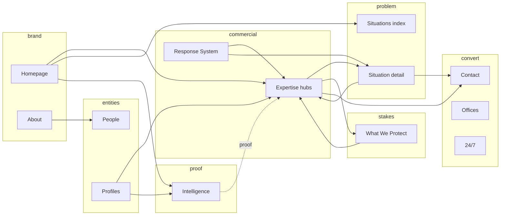

# SEO internal linking architecture

**Status:** Governance-aligned linking strategy  
**Governance:** [`../DESIGN-SYSTEM-GOVERNANCE.md`](../DESIGN-SYSTEM-GOVERNANCE.md) §3 (intent), §9–§10 (primitive boundaries), §17 (leakage), ADR-002 strategic vs editorial separation

**Scope:** *Why* and *how* pages should link to each other for topical authority, UX, and crawl clarity — **without** turning editorial or profiles into marketing grids, and **without** universal “related links” mega-systems.

**Out of scope:** New route trees, automated link injection at scale without editorial oversight, keyword-stuffed anchor text policies.

---

## 1. Authority flow (conceptual)

**Interpretation:** **Expertise** is the commercial spine; **Situations/WWP** explain *why* someone arrives; **Intelligence** provides *proof*; **People** provides *entities*; **Contact/Offices** close — without replacing strategic reading or editorial experience.

---

## 2. Parent / child relationships

| Parent (index) | Child (detail) | Linking rule |
|----------------|----------------|--------------|
| Expertise index | Expertise hubs | Always reciprocal visibility (hub cards). |
| Situations index | Situation detail | Hub → detail; detail → hub via breadcrumb + optional “related situations”. |
| WWP index | WWP detail | Same pattern. |
| Intelligence index | Articles | Editorial components only — **no** `HubLinkCard` substitution (governance §10). |
| People directory | Profiles | Directory → profile; profile → directory facet via explore components. |
| Topic archives | Articles | Topic pages list articles; articles link to topic **when editorially relevant**. |

---

## 3. Cross-family linking rules

### 3.1 Strategic detail → Expertise (required)

- Every **Situation detail** and **WWP detail** should have **explicit** paths to **one or two** primary Expertise hubs that honestly describe how Schillings helps.
- **Anchor text philosophy:** Describe the *user task* or *capability* (“Reputation & privacy capability”, “Litigation & disputes”) — **not** repetitive exact-match spam.

### 3.2 Expertise → Strategic context (required)

- Each **Expertise hub** should link to **relevant Situations** and **WWP** entries that frame *when* clients need that capability.
- **Purpose:** Clarify IA for users and Google; reduce perceived cannibalization by *role differentiation*.

### 3.3 Intelligence → commercial hubs (selective)

- **Articles** may link to Expertise/Situations when **editorially natural** (definitions, deeper reading).
- **Forbidden:** Boilerplate “SEO links” block at end of every article; **forbidden** turning articles into landing pages (governance §3 editorial article intent).

### 3.4 Profiles → Expertise (required, restrained)

- Profiles already surface expertise paths via UI taxonomy — ensure **crawlable** links exist where appropriate.
- **Anchor text:** Use visible expertise labels (human-readable), not stuffed keywords.

### 3.5 Profiles → Intelligence (optional)

- **News by person** module: keep as **proof** of authority; do not force links if empty.

### 3.6 Contact / offices ↔ strategic (careful)

- Office pages may link to **Expertise** and **24/7** — **do not** overwhelm conversion path (Appendix A).
- **Risk class:** **HIGH RISK** if above-fold strategic links multiply on Contact.

---

## 4. Anchor text governance

| Tier | Definition | Example |
|------|------------|---------|
| **Descriptive** | Matches on-page label | “Reputation & privacy” |
| **Navigational** | Brand + section | “Intelligence”, “Contact Schillings” |
| **Problem-framed** | User language | “Hostile media coverage” → situation page |
| **Forbidden** | Repeated exact commercial anchors sitewide | Same money phrase 50× |

**Over-optimization warning:** If an anchor phrase appears on **every** footer, sidebar, and paragraph, pause — variety and honesty beat repetition.

---

## 5. Conversion family protection

- **Contact** and **QualifyingForm** surrounds: links should be **limited**, **high-confidence**, and **utility-placed** (e.g. after form context, office cards).
- **Do not** add strategic grids inside the funnel column (governance §3 conversion intent).

---

## 6. Editorial family protection

- Prefer **contextual inline** links in articles.
- **Topic pages:** May link *up* to Intelligence index and *sideways* to **one** related Expertise hub when the topic **clearly** maps — editorial + SEO review.

---

## 7. Breadcrumb vs in-body links

- **StrategicBreadcrumb** / **PageBreadcrumbs** serve orientation — not a substitute for **in-content** authority links.
- **People** using strategic breadcrumb is governed — don’t replace in-body expertise links with crumbs only.

---

## 8. Implementation phasing

1. **Phase 1 (SAFE):** Audit situation/WWP templates for missing Expertise reciprocals; add 1–2 links with descriptive anchors.  
2. **Phase 2 (REVIEW):** Expertise hub “When clients come to us” blocks linking to situation slugs (copy + placement).  
3. **Phase 3 (REVIEW + editorial):** Intelligence inline cross-links policy (guidelines for authors, not hard requirements per article).  
4. **Phase 4 (HIGH RISK if any):** Contact/office supplementary links — conversion review mandatory.

---

## 9. Measurement

- **GSC:** Landing page report for unintended URL swaps between Expertise and Situations.  
- **Analytics:** Assisted conversions from Intelligence → Contact (if tracked).  
- **Qualitative:** User testing on “I understand what to do next” for situation pages.

---

## 10. Related documents

- [`SEO-CANNIBALIZATION-RISKS.md`](./SEO-CANNIBALIZATION-RISKS.md)
- [`SEO-KEYWORD-INTENT-MAP.md`](./SEO-KEYWORD-INTENT-MAP.md)
- [`SEO-IMPLEMENTATION-ROLLUP.md`](./SEO-IMPLEMENTATION-ROLLUP.md)
